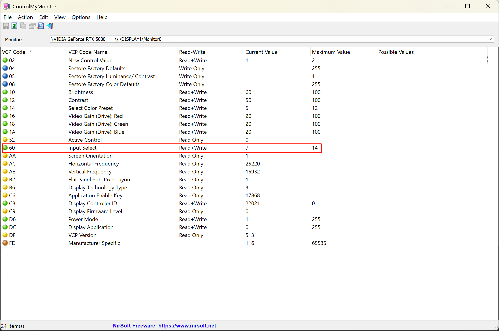
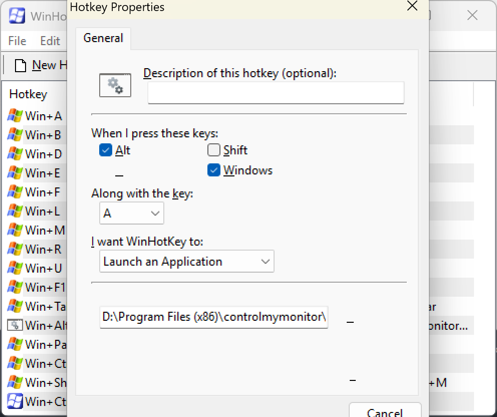
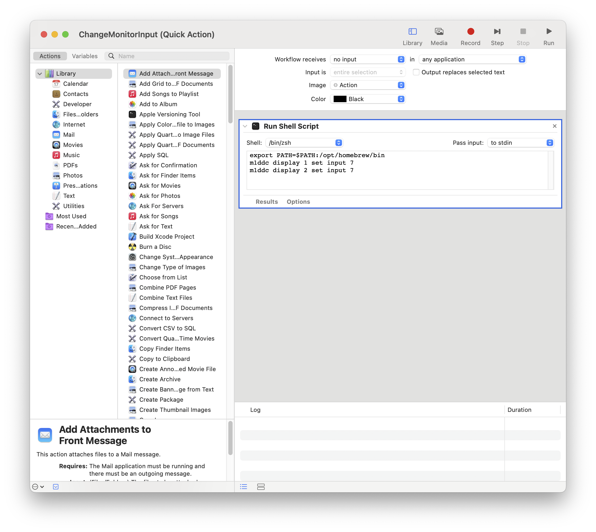
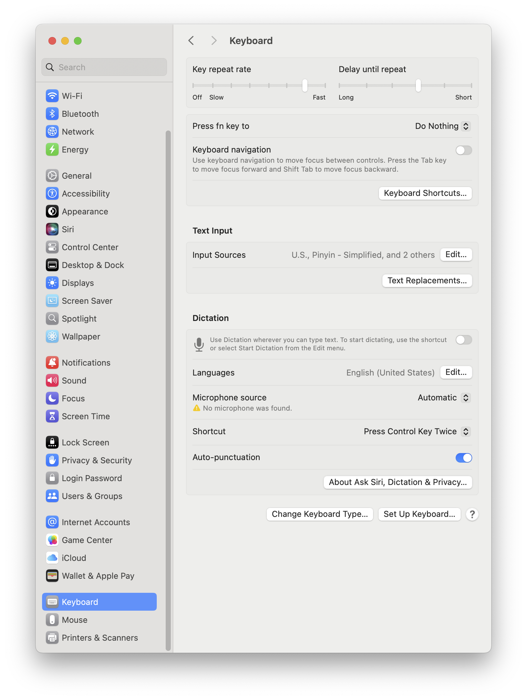
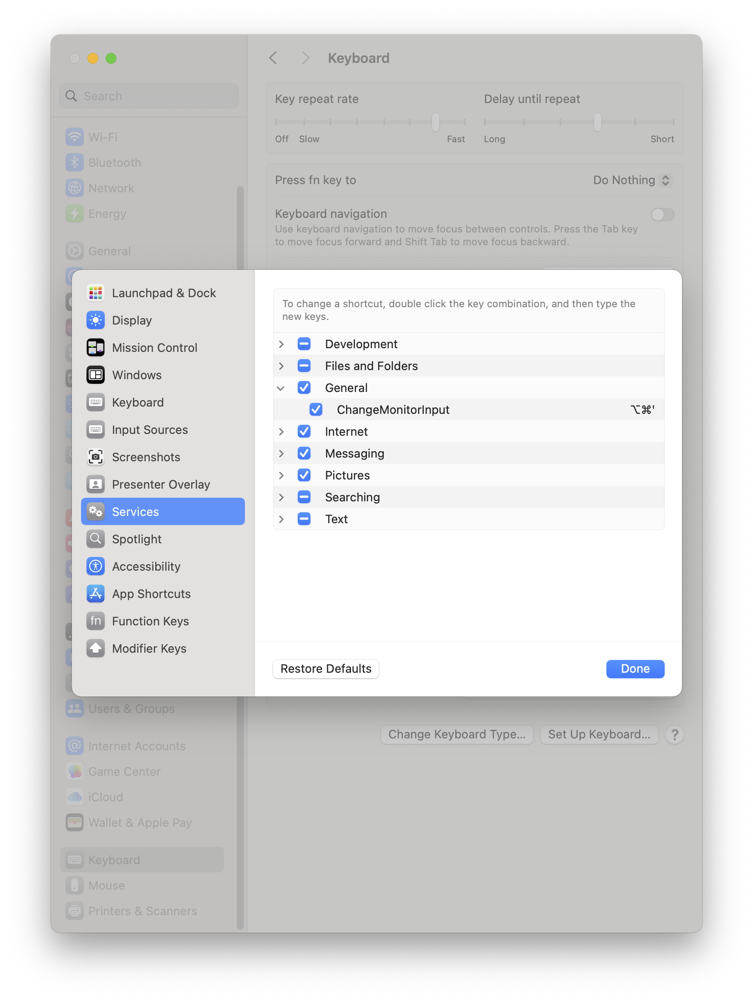

# Cross-Platform Monitor Input Switching Guide

## 🎯 Project Overview

A software + hardware combination solution to achieve seamless monitor input source switching between Windows and macOS devices, supporting one-touch switching of dual monitor input sources between Mac and PC.
I have two screens, one connected to a PC and the other to a Mac. Tired of constantly switching the input source manually, I decided to take matters into my own hands. Drawing inspiration from various videos and blogs, I implemented a solution that not only addressed the issue but also included updates for outdated software and streamlined some of the overly complicated methods I found online.

## 💻 System Requirements

### Windows

- **ControlMyMonitor.exe** - Monitor control tool from NirSoft
- **WinHotKey** - Hotkey binding tool
- Windows 10/11

### macOS

- **m1ddc** - DDC/CI monitor control tool
- **Automator** - Built-in workflow tool
- macOS 10.14+

### Hardware

- Monitors supporting DDC/CI protocol
- Mechanical keyboards with custom key support (recommended) or standalone custom keys (my current solution)
- KVM or multi-input source monitor setup

## 🔧 Windows Configuration

### 1. Install ControlMyMonitor

- Download: [NirSoft ControlMyMonitor](https://www.nirsoft.net/utils/control_my_monitor.html)
- Extract to a fixed directory, e.g., `C:\Program Files (x86)\controlmymonitor\`
- Use ControlMyMonitor to find the monitor's input variable (60) and variable values (my DP input is 7, HDMI input value is 6, type-c input value is 8). It's recommended to connect Windows host using different methods to obtain these variable values, otherwise you'll have to guess
- 

### 2. Create Switching Script

**SetMonitorInputtoMac.bat**

```batch
@echo off
# Windows left screen is DISPLAY1 and it's type-c which is 8
ControlMyMonitor.exe /SetValue "\\.\DISPLAY1\Monitor0" 60 8
# Windows right screen is DISPLAY 2 and it's HDMI which is 6
ControlMyMonitor.exe /SetValue "\\.\DISPLAY2\Monitor0" 60 6
```

* My Mac connects via type-c interface and one HDMI interface
* Store in a fixed directory, e.g., `C:\Program Files (x86)\controlmymonitor\`

### 3. WinHotKey Configuration

- Download: [WinHotKey](https://directedge.us/content/winhotkey/)
- Bind hotkeys to batch file
- 
- Suggested hotkey: `Win + Alt + A` (switch to Mac)

## 🍎 macOS Configuration

### 1. Install m1ddc

```bash
# Ensure Homebrew path
export PATH=$PATH:/opt/homebrew/bin

# Install m1ddc
brew install m1ddc
```

### 2. Create Switching Script

**ChangeMonitorInput.sh**

```bash
#!/bin/bash
export PATH=$PATH:/opt/homebrew/bin
# Switch left screen to USB-C input
m1ddc display 1 set input 7
# Switch right screen to HDMI input
m1ddc display 2 set input 7
```

### 3. Automator Workflow

1. Open Automator, create "Workflow"
2. Add "Run Shell Script" action
3. Paste the above script content
4. Save as ChangeMonitorInput
5. 


### 4. System Shortcut Binding

- System Preferences → Keyboard → Keyboard Shortcuts → Services → General → ChangeMonitorInput
- Add custom shortcut (e.g., Opt + Cmd + ‘)
- 
- 


## ⌨️ Hardware Keyboard Configuration

### Supported Keyboard Types

- QMK firmware keyboards
- VIA supported keyboards
- Vendor custom software keyboards
- Custom keyboards with 2.4GHz receiver support (recommended)

### Key Binding

- Connect the receiver with Win + Alt + A binding to Windows PC
- Connect the receiver with Opt + Cmd + ‘ binding to Mac
- This enables physical key one-touch monitor switching functionality

## 📊 Input Source Code Reference Table

| Input Source Type | Windows Code | macOS Code | Description          |
| ----------------- | ------------ | ---------- | -------------------- |
| HDMI1             | 6            | 6          | First HDMI port      |
| HDMI2             | 6            | 6          | Second HDMI port     |
| DisplayPort       | 7            | 7          | DP port              |
| USB-C/DP          | 8            | 8          | USB-C display output |

## 🔍 Monitor Detection

### Windows

```batch
# View all monitors
ControlMyMonitor.exe /stext monitors.txt

# Get current input source
ControlMyMonitor.exe /GetValue "\\.\DISPLAY1\Monitor0" 60
```

### macOS

```bash
# List all monitors
m1ddc detect

# Get current input source
m1ddc display 1 get input
m1ddc display 2 get input
```

## 🎬 Usage Effects

1. **One-touch switching** - Press custom key, dual monitors switch input sources simultaneously
2. **Seamless experience** - Switching time < 2 seconds, no manual monitor operation needed
3. **Cross-platform** - Windows and macOS use the same physical key

## 🐛 Troubleshooting

### Windows Common Issues

- **ControlMyMonitor not responding**: Check if monitor supports DDC/CI
- **Insufficient permissions**: Run as administrator
- **Wrong monitor number**: Use ControlMyMonitor to check correct monitor identifier

### macOS Common Issues

- **m1ddc command not found**: Check PATH environment variable
- **Permission denied**: Allow terminal access in Security & Privacy
- **Monitor not responding**: Confirm USB-C cable supports display output

### General Issues

- **Input source code mismatch**: Different monitor brands may have different codes, need to test individually
- **Switching delay**: Some monitors need 2-3 seconds recognition time

## 💡 Usage Recommendations

1. **Test input source codes** - Test manually in command line first, confirm codes are correct
2. **Backup original settings** - Record monitor default settings for recovery
3. **Progressive configuration** - Configure single monitor first, then expand to multiple monitors
4. **Regular updates** - Keep software tools up to date

## 🤝 Contribution Guidelines

Welcome submissions of:

- New monitor compatibility test results
- Configuration methods for other keyboard brands
- Improved scripts and tools
- Bug fixes and feature suggestions

## 📄 License

MIT License - Free to use and modify

---

**Author's Note**: This solution has been running stably in my personal work environment for 1+ months, supporting MacBook Pro + Windows desktop dual monitor quick switching scenarios.

---

# 跨平台显示器信号源快捷键切换指南

## 🎯 项目概述

通过软件 + 硬件组合实现Windows和macOS双系统环境下的显示器信号源无缝切换，支持一键在Mac和PC之间切换双显示器输入源。

## 💻 系统要求

### Windows

- **ControlMyMonitor.exe** - NirSoft出品的显示器控制工具
- **WinHotKey** - 热键绑定工具
- Windows 10/11

### macOS

- **m1ddc** - DDC/CI显示器控制工具
- **Automator** - 系统自带工作流工具
- macOS 10.14+

### 硬件

- 支持DDC/CI协议的显示器
- 支持自定义按键的机械键盘（推荐）或单独购买自定义按键（本人目前使用方案）
- KVM或多输入源显示器设置

## 🔧 Windows配置

### 1. 安装ControlMyMonitor

- 下载地址：[NirSoft ControlMyMonitor](https://www.nirsoft.net/utils/control_my_monitor.html)
- 解压到固定目录，如 `C:\Program Files (x86)\controlmymonitor\`
- 通过controlmymonitor找到显示器的输入变量（60）以及变量值（我的DP输入为7，HDMI输入值为6，type-c输入值为8），这里推荐用不同方式链接windows主机来获取该变量值，否则只能猜
- 

### 2. 创建切换脚本

**SetMonitorInputtoMac.bat**

```batch
@echo off
# Windows left screen is DISPLAY1 and it's type-c which is 8
ControlMyMonitor.exe /SetValue "\\.\DISPLAY1\Monitor0" 60 8
# Windows right screen is DISPLAY 2 and it's HDMI which is 6
ControlMyMonitor.exe /SetValue "\\.\DISPLAY2\Monitor0" 60 6
```

* 我的mac通过type-c接口和一个HDMI接口链接
* 存储到固定目录，如 `C:\Program Files (x86)\controlmymonitor\`

### 3. WinHotKey配置

- 下载地址： [WinHotKey](https://directedge.us/content/winhotkey/)
- 绑定快捷键到批处理文件
- 
- 建议快捷键：`Win + Alt + A` (切换到Mac)

## 🍎 macOS配置

### 1. 安装m1ddc

```bash
# 确保Homebrew路径
export PATH=$PATH:/opt/homebrew/bin

# 安装m1ddc
brew install m1ddc
```

### 2. 创建切换脚本

**switch-to-mac.sh**

```bash
#!/bin/bash
export PATH=$PATH:/opt/homebrew/bin
# 左屏切换到USB-C输入
m1ddc display 1 set input 7
# 右屏切换到HDMI输入
m1ddc display 2 set input 7
```

### 3. Automator工作流

1. 打开Automator，创建"Workflow"
2. 添加"运行Shell脚本"操作
3. 粘贴上述脚本内容
4. 保存为ChangeMonitorInput
5. 


### 4. 系统快捷键绑定

- 系统偏好设置 → 键盘 → 键盘快捷键 → Services → General → ChangeMonitorInput
- 添加自定义快捷键（比如Opt + Cmd + ‘）
- 
- 

## ⌨️ 硬件键盘配置

### 支持的键盘类型

- QMK固件键盘
- VIA支持的键盘
- 厂商自定义软件键盘
- 支持2.4GHz接收器的自定义键盘（推荐）

### 按键绑定

- 将Win + Alt + A绑定的按键接收器连接到Windows PC上
- 将Opt + Cmd + ‘绑定的按键接收器链接到Mac上
- 这样就可以实现物理按键一键切换显示器的功能

## 📊 输入源代码对照表

| 输入源类型  | Windows代码 | macOS代码 | 说明           |
| ----------- | ----------- | --------- | -------------- |
| HDMI1       | 6           | 6         | 第一个HDMI接口 |
| HDMI2       | 6           | 6         | 第二个HDMI接口 |
| DisplayPort | 7           | 7         | DP接口         |
| USB-C/DP    | 8           | 8         | USB-C显示输出  |

## 🔍 显示器识别

### Windows

```batch
# 查看所有显示器
ControlMyMonitor.exe /stext monitors.txt

# 获取当前输入源
ControlMyMonitor.exe /GetValue "\\.\DISPLAY1\Monitor0" 60
```

### macOS

```bash
# 列出所有显示器
m1ddc detect

# 获取当前输入源
m1ddc display 1 get input
m1ddc display 2 get input
```

## 🎬 使用效果

1. **一键切换** - 按下自定义按键，双显示器同时切换信号源
2. **无缝体验** - 切换时间 < 2秒，无需手动操作显示器
3. **跨平台** - Windows和macOS使用相同的物理按键

## 🐛 故障排除

### Windows常见问题

- **ControlMyMonitor无响应**：检查显示器是否支持DDC/CI
- **权限不足**：以管理员身份运行
- **显示器编号错误**：使用ControlMyMonitor查看正确的显示器标识

### macOS常见问题

- **m1ddc命令找不到**：检查PATH环境变量
- **权限被拒绝**：在安全性与隐私中允许终端访问
- **显示器不响应**：确认USB-C线缆支持显示输出

### 通用问题

- **输入源代码不匹配**：不同品牌显示器代码可能不同，需要逐一测试
- **切换延迟**：某些显示器需要2-3秒识别时间

## 💡 使用建议

1. **测试输入源代码** - 先在命令行手动测试，确认代码正确
2. **备份原始设置** - 记录显示器默认设置以便恢复
3. **渐进式配置** - 先配置单个显示器，再扩展到多显示器
4. **定期更新** - 保持软件工具最新版本

## 🤝 贡献指南

欢迎提交：

- 新的显示器兼容性测试结果
- 其他品牌键盘的配置方法
- 改进的脚本和工具
- Bug修复和功能建议

## 📄 许可证

MIT License - 自由使用和修改

---

**作者注**：这个方案已在个人工作环境中稳定运行1个月+，支持MacBook Pro + Windows台式机的双显示器快速切换场景。
